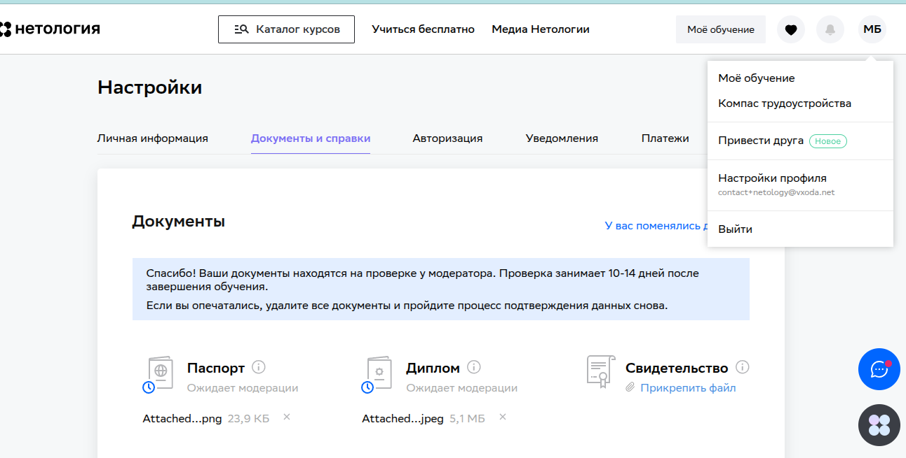

#Задание для допуска к дипломной работе -- Михаил Байков

**1. Получилось ли у вас загрузить в личный кабинет документы, подтверждающие личность, и диплом о высшем или среднем специальном образовании?**

а) Да
Пришлите ссылку на скриншот личного кабинета.

**2. Нужна ли вам справка об обучении после сдачи дипломной работы? Справка выдаётся всем студентам, в том числе тем, у кого нет диплома о высшем или среднем специальном образовании.**

б) Нет

**3. Выполнен ли вами необходимый минимум заданий на каждом модуле профессии для допуска к дипломной работе?**

а) Да
Поздравляем! Сообщим вам позже, кто будет вашим дипломным руководителем.
